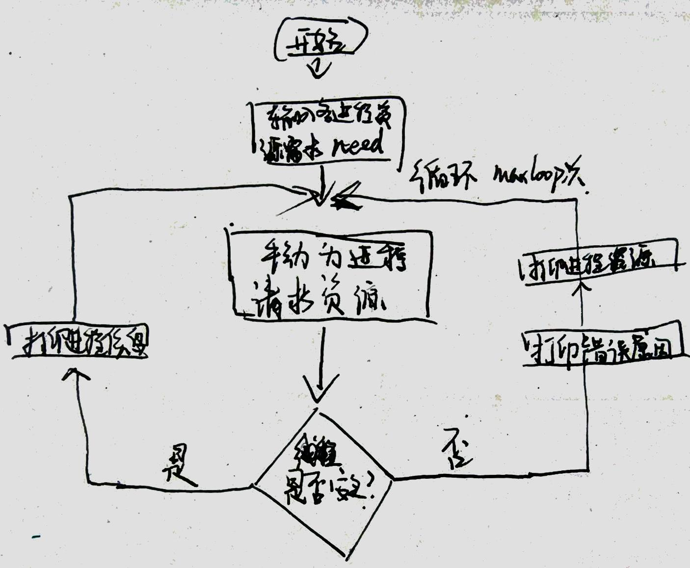

### 一、进程调度

#### 1. 实验目的

#### 2. 实验内容

#### 3. 实验步骤

#### 4. 实验总结

### 一、死锁
#### 1. 实验目的
>独立地采用高级语言编写一个动态分配系统资源的程序，模拟死锁现象，观察死锁发生的条件，并采用适当的算法，有效地防止死锁的发生。通过本次实验，能够更直观地了解死锁发生的原因，初步掌握防止死锁、解除死锁的简单方法，加深理解教材中有关死锁的内容。
#### 2. 实验内容
>本次实验采用银行算法防止死锁的发生。设有3个并发进程共享10个系统资源。在3个进程申请系统资源之和不超过10时，当然不可能发生死锁，因为各个进程资源都能满足。在有一个进程申请的系统资源数超过10时，必然会发生死锁。应该排队这两种情况。程序采用人工输入各进程的申请资源序列。如果随机给各进程分配资源，就可能发生死锁，这也就是不采用防止死锁算法的情况。假如，按照一定的规则，为各进程分配资源，就可以防止死锁的发生。示例采用银行算法。这是一种犹如“瞎子爬山”的方法，即探索一步，前进一步，行不通，再往其它方向试探，直至爬上山顶。这种方法是比较保守的，所花的代价也不小。	
#### 3. 实验步骤
##### (1) 任务分析
>3个进程共享10个资源，首先输入3个进程分别需要的资源数，再依次手动为进程申请资源，每一次申请都进行安全性检查。
>每申请一次，就列出当前资源剩余和当前每个线程的信息，包括已分配的资源、仍需要的资源、是否已经完成。并给出是否申请成功，如果失败，失败的原因。
##### (2) 概要设计

##### (3) 详细设计
.png)
.png)
.png)
##### (4) 测试结果
##### (5) 使用说明
#### 4. 实验总结

### 一、存储管理
#### 1. 实验目的
#### 2. 实验内容
#### 3. 实验步骤
#### 4. 实验总结

### 一、文件系统
#### 1. 实验目的
#### 2. 实验内容
#### 3. 实验步骤
#### 4. 实验总结
